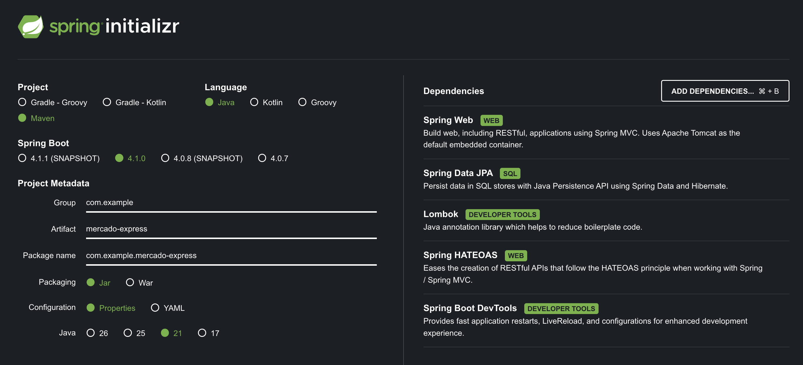
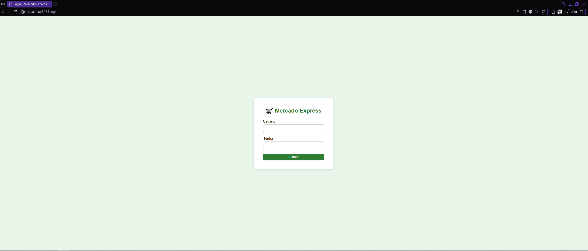
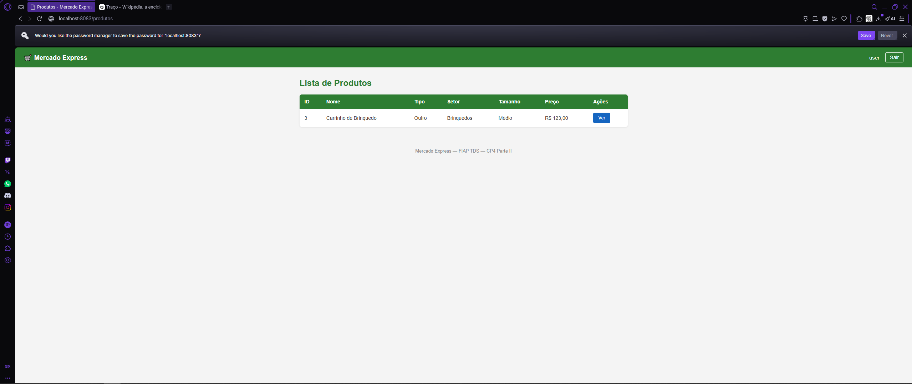
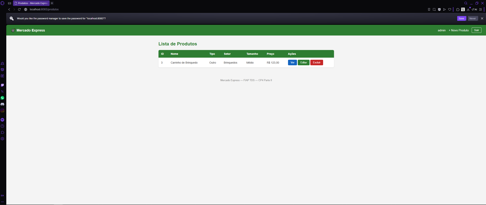
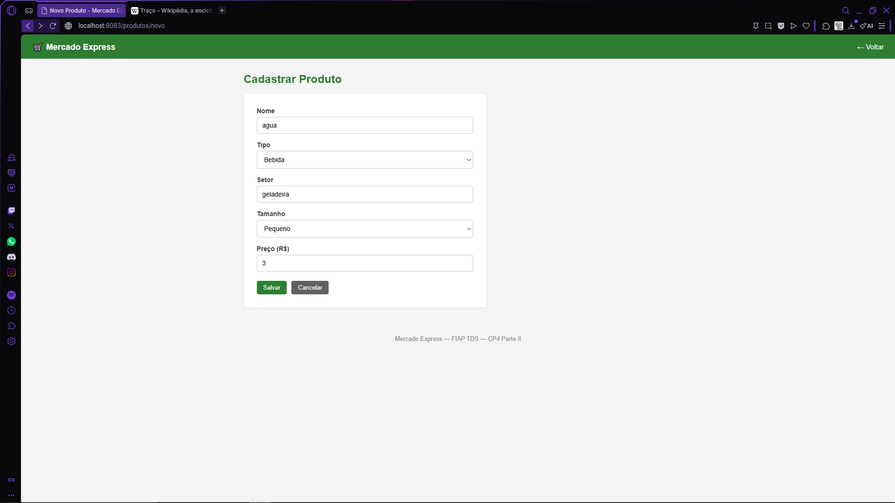
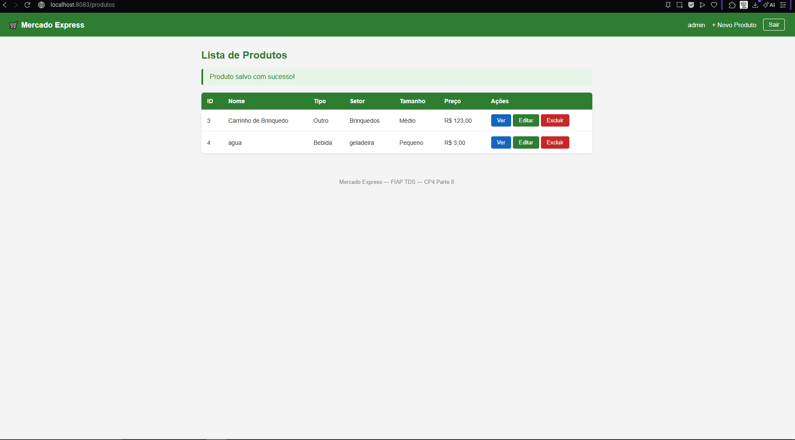
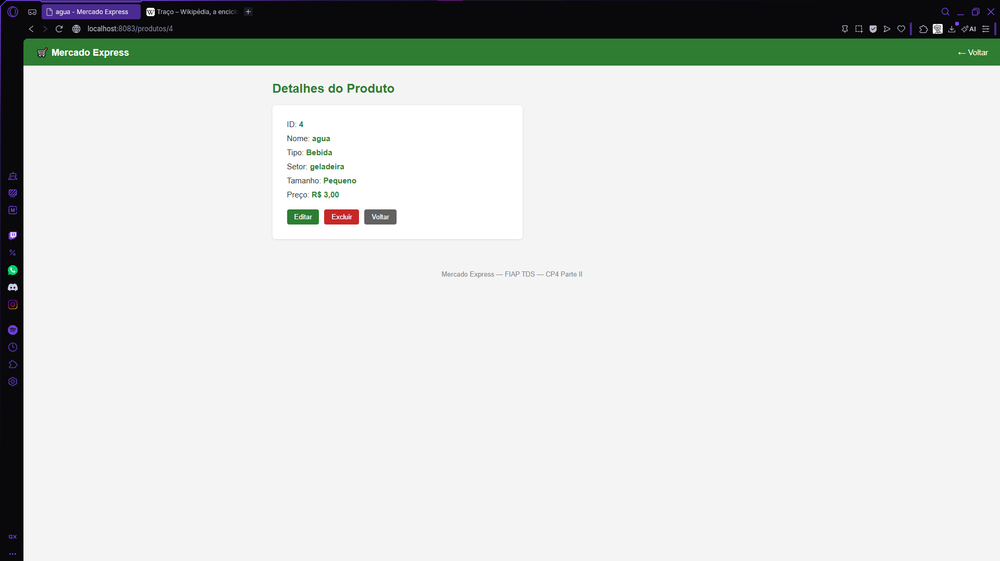
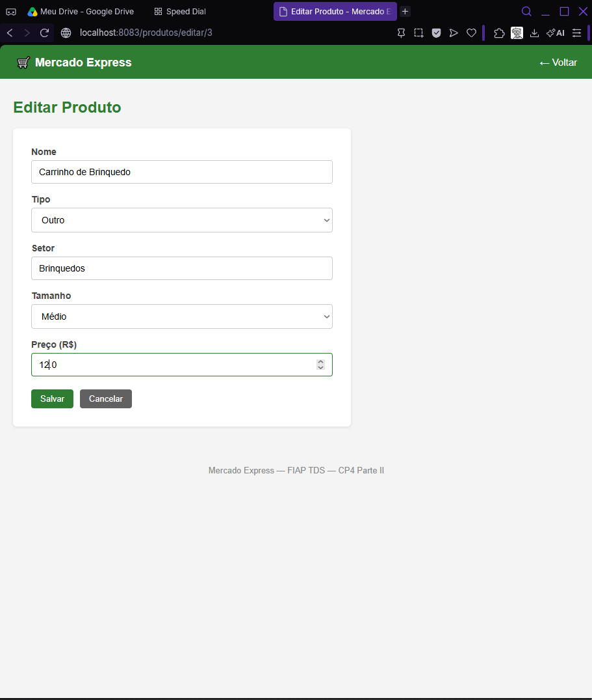
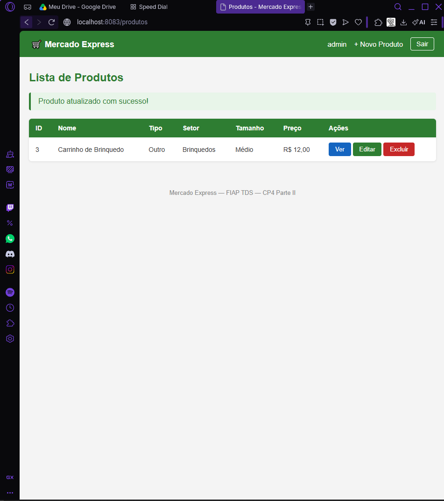
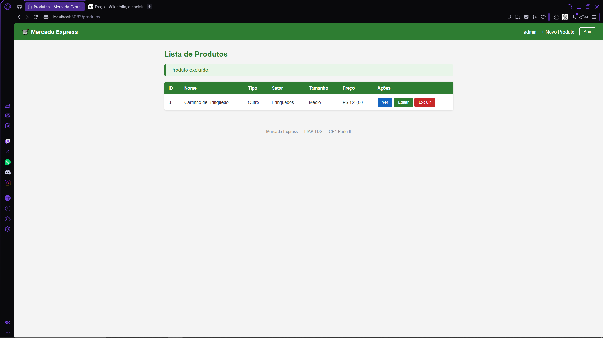

# Mercado Express — Parte II (Spring MVC + Security)

Aplicação web desenvolvida com Spring MVC e Thymeleaf para gerenciamento de produtos de um mercado express. Utiliza o mesmo banco Oracle da Parte I e implementa controle de acesso com Spring Security.

**IDE utilizada:** IntelliJ IDEA

---

## Integrantes

| Nome | RM |
|---|---|
| Ana Flavia Camelo | 561489 |
| Gustavo Kenji Terada | 562745 |
| João Guilherme Carvalho Novaes | 566234 |
| Pedro Chasci Puga | 565154 |
| Lucas Figueiredo Vieira | 561342 |

---

## Tecnologias utilizadas

- Java 21
- Spring Boot 4.1.0
- Spring MVC
- Thymeleaf
- Spring Security
- Spring Data JPA
- Lombok
- Oracle Database (ORACLE_FIAP)
- Maven

---

## Configuração do Spring Initializr



---

## Banco de Dados Oracle

Tabela: `TDS_MVC_TB_MERCADO`

| Coluna | Tipo |
|---|---|
| ID | NUMBER (PK, auto increment) |
| NOME | VARCHAR2(255) |
| TIPO | VARCHAR2(255) |
| SETOR | VARCHAR2(255) |
| TAMANHO | VARCHAR2(255) |
| PRECO | NUMBER |

> A conexão usa as mesmas variáveis de ambiente da Parte I (`DB_URL`, `DB_USER`, `DB_PASSWORD`) via arquivo `.env`.

---

## Como executar localmente

1. Clone o repositório
2. Crie o arquivo `.env` na raiz do projeto:
```
DB_URL=jdbc:oracle:thin:@//oracle.fiap.com.br:1521/orcl
DB_USER=seu_rm
DB_PASSWORD=sua_senha
```
3. Execute:
```bash
./mvnw spring-boot:run
```
4. Acesse: `http://localhost:8083`

---

## Spring Security — Rotas e Controle de Acesso

A aplicação define dois perfis de usuário com permissões diferentes:

| Usuário | Senha | Perfil |
|---|---|---|
| admin | admin123 | ADMIN — pode criar, editar e excluir |
| user | user123 | USER — somente visualização |

### Rotas públicas (sem login)

| Rota |
|---|
| `/login` |
| `/css/**` |

### Rotas privadas (requer login)

| Rota | Acesso |
|---|---|
| `GET /produtos` | Autenticado |
| `GET /produtos/{id}` | Autenticado |
| `GET /produtos/novo` | Somente ADMIN |
| `POST /produtos/salvar` | Somente ADMIN |
| `GET /produtos/editar/{id}` | Somente ADMIN |
| `POST /produtos/editar/{id}` | Somente ADMIN |
| `GET /produtos/deletar/{id}` | Somente ADMIN |

---

## Endpoints — CRUD

Base URL: `http://localhost:8083`

---

### Tela de Login

Rota pública — acessível sem autenticação.

`GET /login`



---

### Listagem de Produtos

`GET /produtos` — lista todos os produtos cadastrados no banco.

Logado como **USER** — botões de editar e excluir não são exibidos. O controle é feito via `sec:authorize="hasRole('ADMIN')"` nos templates Thymeleaf.



Logado como **ADMIN** — todos os botões disponíveis.



---

### Cadastrar Produto

`GET /produtos/novo` — exibe o formulário de cadastro.

`POST /produtos/salvar` — salva o novo produto no banco.





---

### Ver Detalhes

`GET /produtos/{id}` — exibe os dados completos de um produto consultado pelo ID.



---

### Editar Produto

`GET /produtos/editar/{id}` — exibe o formulário preenchido com os dados atuais do produto.

`POST /produtos/editar/{id}` — atualiza o produto no banco.





---

### Excluir Produto

`GET /produtos/deletar/{id}` — exclui o produto e redireciona para a listagem.



---

### Rota bloqueada pelo Security

Ao tentar acessar uma rota privada sem permissão, o Spring Security bloqueia e redireciona para o login.


---

## Estrutura do Projeto

```
mercado-express-mvc/
├── src/main/java/com/example/mercadoexpressmvc/
│   ├── config/
│   │   └── SecurityConfig.java       # Configuração de rotas e usuários
│   ├── controller/
│   │   ├── AuthController.java       # Rota de login e redirect da home
│   │   └── ProdutoController.java    # CRUD via MVC
│   ├── model/
│   │   └── Produto.java              # Entidade JPA
│   ├── repository/
│   │   └── ProdutoRepository.java    # Acesso ao banco
│   ├── service/
│   │   └── ProdutoService.java       # Regras de negócio
│   └── MercadoExpressMvcApplication.java
├── src/main/resources/
│   ├── templates/
│   │   ├── auth/
│   │   │   └── login.html
│   │   └── produto/
│   │       ├── lista.html
│   │       ├── form.html
│   │       └── detalhe.html
│   ├── static/css/
│   │   └── style.css
│   └── application.properties
└── pom.xml
```